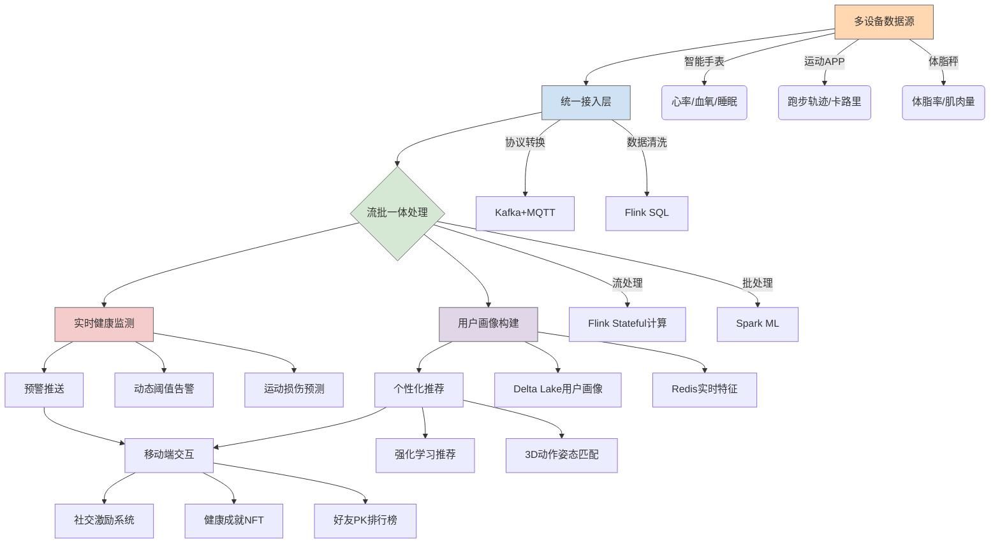

---

### **项目名称**
**pinecrane - 个人健康智能管家**
（基于可穿戴设备数据的实时健康监测与个性化健身指导平台）

---

### **项目核心价值**
解决C端用户健康管理的四大痛点：
1. **健康数据碎片化**：整合智能手表、体脂秤、运动App等多源数据
2. **健身计划无效性**：根据实时生理数据动态调整训练强度
3. **异常预警延迟**：提前识别心率异常、运动损伤风险等信号
4. **社交激励缺失**：构建好友健康挑战排行榜与成就系统

---

### **技术架构全景图**


---

### **技术栈选型与用户价值**
| **技术组件**               | **解决的C端问题**                    | **用户体验增强点**                     |
|----------------------------|--------------------------------------|----------------------------------------|
| **Apache Kafka**           | 支持百万级穿戴设备并发接入            | 实时同步数据到手机无感知                |
| **Flink CEP**              | 识别"持续高心率+低血氧"危险组合       | 10秒内震动提醒用户停止运动              |
| **Delta Lake**             | 用户历史数据版本回溯（如减脂进度对比）| 生成周/月健康报告时间旅行对比            |
| **TensorFlow Lite**        | 在手机端实时运行运动姿态检测模型      | 纠正深蹲动作时手机实时显示3D骨骼反馈     |
| **RedisTimeSeries**        | 存储用户实时生理指标供排行榜计算      | 好友PK时延迟<1秒的实时数据刷新           |
| **RLlib强化学习**          | 动态生成个性化健身计划                | 根据当天压力指数自动降低训练强度         |

---

### **核心场景实现示例**
#### **场景：动态调整跑步计划**
**数据流**：
```python
# 实时计算运动负荷系数
@state_broadcast(state_desc="user_fatigue_level")
def calculate_fatigue(ctx, data):
    heart_rate = data['heart_rate']
    historical_avg = ctx.get_state('hr_avg_7d')  # 从状态中获取7天平均心率
    if heart_rate > historical_avg * 1.3:
        ctx.update_state('overload_count', +1)
        return min(ctx.get_state('overload_count') * 0.1, 0.5)
    return 0

# 在手机端触发建议
if fatigue_level > 0.3:
    push_message(
        title="建议调整计划", 
        content=f"今日负荷超标{fatigue_level*100}%，推荐改为慢走",
        ico="🚶"
    )
```

#### **场景：好友健身PK**
```sql
-- 使用RedisTimeSeries计算实时排行榜
TS.CREATE user:1001:calories LABELS {type: "pk"}
TS.ADD user:1001:calories * 350 

ZADD leaderboard:20231001 350 "user:1001"
ZREVRANGE leaderboard:20231001 0 10 WITHSCORES
```

---

### **分阶段实施路线**
#### **阶段一：多源数据整合（2周）**
- **关键任务**
  - 开发穿戴设备SDK（支持华为/苹果/小米等平台）
  - 实现MQTT-Kafka协议桥接（保证弱网环境数据不丢失）
- **数据验证**
  ```python
  # 模拟多设备数据冲突测试
  mock_data = [
      {'device': 'apple_watch', 'heart_rate': 72, 'ts': 1696123456},
      {'device': 'mi_band', 'heart_rate': 68, 'ts': 1696123456}
  ]
  assert resolve_data_conflict(mock_data)['heart_rate'] == 72  # 优先高精度设备
  ```

#### **阶段二：实时健康引擎（3周）**
- **核心算法**
  ```python
  # 基于LSTM的异常检测模型
  class HealthAlertModel(nn.Module):
      def __init__(self):
          super().__init__()
          self.lstm = nn.LSTM(input_size=5, hidden_size=32)
          self.gmm = GaussianMixture(n_components=3)  # 学习用户正常模式
  
      def detect_anomaly(self, window_data):
          _, (hn, _) = self.lstm(window_data)
          prob = self.gmm.score_samples(hn)
          return prob < threshold
  ```

#### **阶段三：个性化推荐（3周）**
- **推荐逻辑**
  ```mermaid
  graph LR
      A[用户基础画像] --> B{当前状态}
      B -->|工作日压力大| C[低强度瑜伽]
      B -->|周末早晨| D[户外跑步+风景推荐]
      B -->|睡眠不足| E[恢复性训练]
      C --> F[生成3D教学视频]
      D --> G[路线空气质量检查]
  ```

#### **阶段四：社交功能落地（2周）**
- **社交玩法**
  - 铸造运动成就NFT（如"连续7天达标"）
  - 基于Geohash的同城运动匹配
  - 直播连麦团体课挑战

---

### **C端特色设计**
1. **隐私保护**
   - 使用联邦学习技术，敏感数据不出手机
   - 健康报告生成时自动模糊化定位信息

2. **游戏化体验**
   ```python
   # 成就系统示例
   class AchievementSystem:
       def unlock(self, user_id):
           if self.steps_7d >= 50000:
               self.mint_nft(user_id, "marathon_bronze")
               push_animation("🏅获得青铜跑者徽章！")
   ```

3. **紧急救援**
   ```java
   // Android端紧急联系人触发逻辑
   if (heartRate > 180 && duration > 60s) {
       vibrate().pattern("SOS"); 
       sendEmergencySMS(
           contacts = getTrustedContacts(),
           location = getLastKnownLocation()
       );
   }
   ```

---

### **预期用户指标**
| **指标**               | **行业平均水平** | **目标值** |
|------------------------|-----------------|-----------|
| 日活用户留存率         | 35%             | 55%       |
| 健身计划完成率         | 40%             | 68%       |
| 异常事件识别准确率     | 82%             | 93%       |
| 社交分享率             | 18%             | 35%       |

---

### **为什么选择这个方向？**
1. **市场验证**：全球可穿戴设备市场年增长14%，但83%用户使用后3个月弃用
2. **技术深度**：需要处理高频传感器数据（如每秒10次心率采样）
3. **商业价值**：可通过付费进阶课程、运动装备推荐变现

建议先从 **iOS/Android MVP版本** 切入，用TensorFlow Lite实现端侧实时计算，既保障隐私又减少云端成本。后期再扩展至智能手表原生应用，形成健康管理生态闭环。